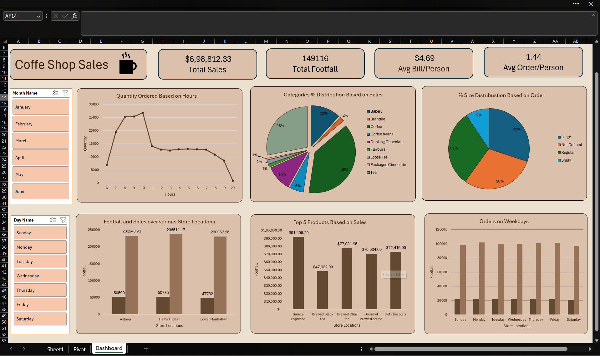
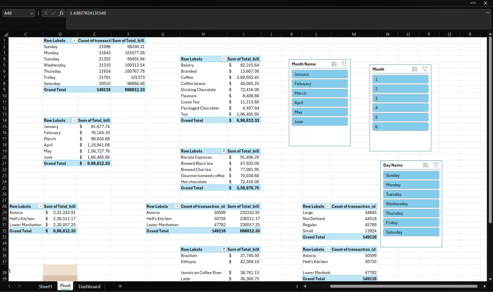

# ☕ Coffee Shop Sales Dashboard

---

# 📌 Project Overview

This project is an interactive Coffee Shop Sales Dashboard built in Microsoft Excel to analyze sales performance, customer purchasing behavior, product demand, store performance, and business trends.

The dashboard transforms raw transactional data into meaningful insights using Pivot Tables, Pivot Charts, KPI Cards, and Slicers.

---

# 🎯 Business Objective

The objective of this dashboard is to help business owners understand:

- Overall sales performance
- Customer footfall
- Product category contribution
- Best-selling products
- Store-wise performance
- Sales trends by month and weekday

---

# 🛠️ Tools Used

- Microsoft Excel
- Pivot Tables
- Pivot Charts
- KPI Cards
- Slicers
- Data Cleaning
- Dashboard Design

---

# 📊 Dashboard Preview

---

# 📂 Dataset Preview

---

# 📈 Pivot Table Analysis

---

# 📌 Key Performance Indicators (KPIs)

- 💰 Total Sales: **$698,812.33**
- 👣 Total Footfall: **149,116**
- 💵 Average Bill per Person: **$4.69**
- ☕ Average Orders per Person: **1.44**

---

# 💡 Key Insights

- Coffee generated the highest sales among all categories.
- Tea contributed significantly to overall revenue.
- Hell's Kitchen recorded the highest sales.
- Barista Espresso was the top-selling product.
- Morning hours experienced the highest customer traffic.
- Weekday sales remained consistent across the week.

---

# 🚀 Skills Demonstrated

- Data Cleaning
- Data Analysis
- Business Intelligence
- Dashboard Design
- Data Visualization
- KPI Reporting
- Excel Analytics

---

# 📁 Files Included

- Coffee_Sales.xlsx
- Raw Data of Coffee Shop Sales.xlsx
- Dashboard.png
- Pivot.png
- Data.png

---

⭐ If you found this project useful, don't forget to star this repository.
