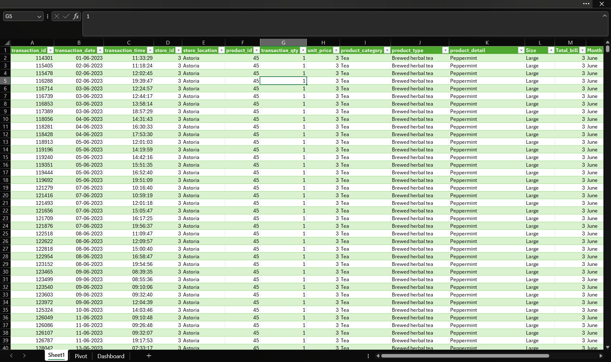

# ☕ Coffee Shop Sales Dashboard

An interactive **Microsoft Excel Dashboard** built to analyze coffee shop sales performance using Pivot Tables, Pivot Charts, KPI Cards, Slicers, and Data Visualization.

---

# 📌 Project Overview

This project analyzes coffee shop sales data to uncover valuable business insights. The dashboard provides an interactive view of sales performance, customer purchasing behavior, product demand, store performance, and sales trends, enabling data-driven decision-making.

---

# 🎯 Business Objective

The primary objective of this project is to:

- Analyze overall sales performance
- Understand customer purchasing behavior
- Identify best-selling products
- Compare store-wise performance
- Monitor monthly and weekday sales trends
- Support business decision-making through interactive dashboards

---

# 🛠️ Tools & Technologies

- Microsoft Excel
- Pivot Tables
- Pivot Charts
- KPI Cards
- Slicers
- Data Cleaning
- Data Visualization

---

# 📊 Main Dashboard

---

# 📷 Dashboard Features

- 💰 Total Sales
- 👣 Total Footfall
- 💵 Average Bill per Person
- ☕ Average Orders per Person
- 📈 Monthly Sales Trend
- 📅 Weekday Sales Analysis
- 🏪 Store-wise Sales
- ☕ Product Category Analysis
- 🎯 KPI Cards
- 🎛️ Interactive Slicers

---

# 📸 Dashboard Screenshots

## 📊 Dataset Preview

---

## 📈 Pivot Table Analysis

---

# 📌 Key Performance Indicators (KPIs)

| KPI | Value |
|------|--------|
| 💰 Total Sales | **$698,812.33** |
| 👣 Total Footfall | **149,116** |
| 💵 Average Bill per Person | **$4.69** |
| ☕ Average Orders per Person | **1.44** |

---

# 💡 Key Insights

- Coffee generated the highest sales among all product categories.
- Tea was the second-highest revenue contributor.
- Hell's Kitchen recorded the highest store sales.
- Barista Espresso was the best-selling product.
- Morning hours experienced the highest customer traffic.
- Sales remained consistent throughout the weekdays.

---

# 🚀 Skills Demonstrated

- Data Cleaning
- Data Analysis
- Dashboard Development
- Business Intelligence
- Data Visualization
- KPI Reporting
- Excel Dashboard Design

---

# 📂 Project Files

- 📊 Coffee_Sales_Analysis.xlsx
- 📄 Coffee_Sales_Raw_Data.xlsx
- 🖼️ Coffee_Sales_Dashboard.png
- 🖼️ Coffee_Sales_Dataset.png
- 🖼️ Pivot_Table.png

---

# 🚀 Future Improvements

- Power BI Dashboard Version
- SQL-Based Sales Analysis
- Power Query Automation
- Interactive Excel Reports

---

# 👨‍💻 Author

**Ayush Shedge**

🎯 Aspiring Data Analyst

---

# 📬 Connect With Me

- **GitHub:** https://github.com/ayushshedge24-tech
- **LinkedIn:** https://www.linkedin.com/in/ayush-shedge-analytic

---

⭐ **If you found this project useful, please consider giving it a Star!**
